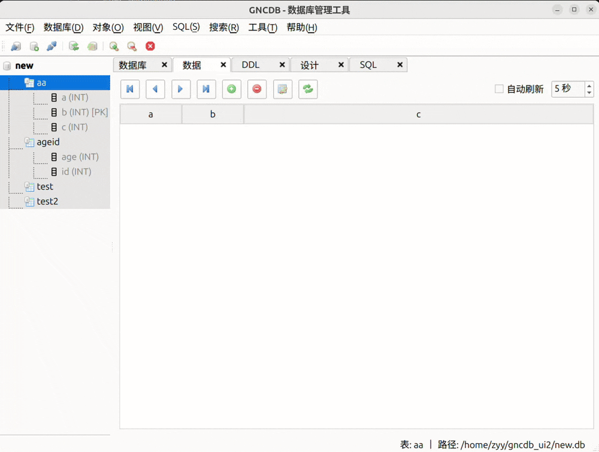

# GNCDB UI - 数据库管理工具 

## 项目简介

GNCDB UI 是一个专为 GNCDB 数据库定制的现代化图形界面管理工具。它提供了丰富的功能，使数据库操作变得简单、直观，既适合初学者使用，也满足专业用户的需求。

本工具采用 Qt 框架开发，拥有美观的界面和流畅的用户体验，支持全面的数据库管理功能，包括数据库的创建、表的管理及复杂SQL查询的执行。


## 主要功能

### 数据库管理

- 创建、连接和断开数据库连接
- 数据库信息查看与管理
- 数据库压缩


### 表管理

- 创建和删除表
- 表结构可视化查看和编辑
- 多样化的表数据展示视图



### 数据操作

- 数据的增加、查询、修改和删除
- 批量数据导入与导出
- 高级数据搜索和过滤功能


### SQL 操作

- SQL 语句编辑器（支持语法高亮）
- SQL 查询结果可视化展示
- SQL 脚本执行与管理


## 技术特点

- **现代化界面**：基于 Qt 框架的美观用户界面
- **语法高亮**：支持 SQL 语法高亮，提高编码效率
- **多标签设计**：采用标签页设计，方便同时处理多项任务
- **树形结构**：通过树形视图直观展示数据库结构
- **自定义主题**：支持切换界面主题，满足个性化需求
- **高性能**：基于高效的 GNCDB 引擎，保证大数据量下的性能表现
- **跨平台**：支持 Windows、Linux 和 macOS 等多平台环境

## 安装说明

### 系统要求

- **操作系统**: Windows 10+, Ubuntu 20.04+, macOS 10.15+
- **内存**: 最少 4GB RAM
- **磁盘空间**: 至少 100MB 可用空间

### 安装步骤

#### 预编译版本

1. 从 [发布页面](https://github.com/yourusername/gncdb_ui/releases) 下载最新版安装包
2. 根据您的操作系统执行相应的安装程序
3. 按照安装向导完成安装

#### 从源码构建

```bash
# 克隆仓库
git clone https://github.com/yourusername/gncdb_ui.git
cd gncdb_ui

# 创建构建目录
mkdir build && cd build

# 配置和构建项目
cmake ..
make -j4

# 运行程序
../gncdb_ui2
```

## 快速入门

### 连接数据库

1. 启动 GNCDB UI 应用程序
2. 点击工具栏中的"连接"按钮或选择"文件 > 连接数据库"
3. 在弹出的对话框中选择数据库文件，或创建新的数据库
4. 点击"确定"完成连接

### 创建新表

1. 连接数据库后，点击工具栏上的"创建表"按钮
2. 在表设计器中输入表名和定义列
3. 为每列设置名称、数据类型和约束
4. 点击"确定"创建表

### 执行 SQL 查询

1. 切换到 SQL 标签页
2. 在编辑器中输入 SQL 语句
3. 点击"执行"按钮或按下 Ctrl+Enter
4. 在结果区域查看查询结果

## 预期实现功能

### 数据导入导出

支持从多种格式导入数据，并导出到多种格式：

- CSV 文件
- SQL 脚本
- JSON 数据

### 数据库优化

提供数据库性能优化功能：

- 数据库压缩（VACUUM）
- 索引优化
- 查询性能分析

### 自定义界面

- 自定义工具栏布局
- 多种界面主题选择
- 可调整的面板大小

## 开发文档

如果您想为 GNCDB UI 项目贡献代码，请参考我们的开发文档：

### 项目结构

